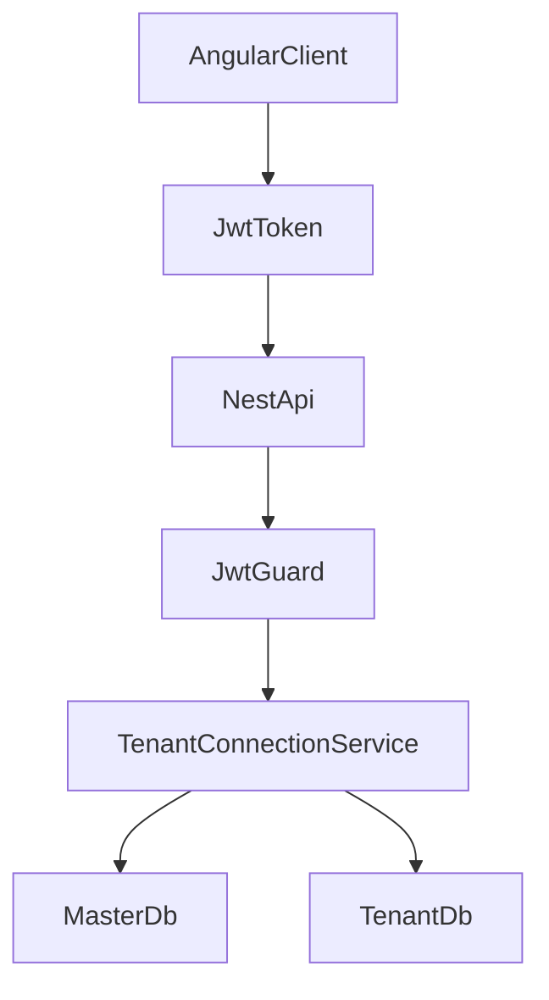

# Multi-Tenant CRM SaaS PoC

## Plan

### Documentation References

- Angular routing and guards: [angular.dev/guide/routing](https://angular.dev/guide/routing) and [angular.dev/guide/routing/route-guards](https://angular.dev/guide/routing/route-guards)
- Angular Material setup: [material.angular.dev/guide/getting-started](https://material.angular.dev/guide/getting-started)
- NestJS authentication: [docs.nestjs.com/security/authentication](https://docs.nestjs.com/security/authentication)
- NestJS Swagger: [docs.nestjs.com/recipes/swagger](https://docs.nestjs.com/recipes/swagger)
- Prisma schema overview: [prisma.io/docs/orm/prisma-schema/overview](https://www.prisma.io/docs/orm/prisma-schema/overview)
- Atlas with Prisma: [atlasgo.io/guides/orms/prisma](https://atlasgo.io/guides/orms/prisma)
- Neon connection setup: [neon.com/docs/connect/connect-from-any-app](https://neon.com/docs/connect/connect-from-any-app)

### Architecture Overview

- Repository will be a simple monorepo with `backend/` for NestJS, `frontend/` for Angular, and root-level infra/config docs for Prisma, Atlas, and Neon setup.
- Multi-tenancy will use a master database for identity and membership resolution plus one database per tenant for CRM business data.
- Auth flow will be 2-step: `POST /auth/login` validates against master DB and returns memberships; `POST /auth/select-tenant` issues a JWT containing `sub`, `tenantId`, and `role`.
- Tenant-aware CRM requests will resolve the tenant DB dynamically through a cached `TenantConnectionService` that loads the target `database_url` from the master DB.

### Repository Layout To Generate

- Root files: `package.json`, `README.md`, `.env.example`, `docker-compose.yml`, `atlas.hcl`, `tsconfig.base.json`
- Backend app: `backend/src/main.ts`, `backend/src/app.module.ts`, `backend/src/config/database.config.ts`
- Backend database layer: `backend/src/database/prisma/master-prisma.service.ts`, `backend/src/database/tenant-manager/tenant-connection.service.ts`
- Backend auth and guards: `backend/src/modules/auth`, `backend/src/common/guards/jwt-auth.guard.ts`, `backend/src/common/guards/roles.guard.ts`, `backend/src/common/decorators/current-user.decorator.ts`
- Backend CRM modules: `backend/src/modules/customers`, `backend/src/modules/deals`, `backend/src/modules/activities`, `backend/src/modules/tenants`
- Prisma schemas: `backend/prisma/master/schema.prisma`, `backend/prisma/tenant/schema.prisma`
- Atlas migration folders: `backend/atlas/master`, `backend/atlas/tenant`
- Angular app shell: `frontend/src/main.ts`, `frontend/src/app/app.routes.ts`, `frontend/src/app/app.config.ts`
- Angular core: `frontend/src/app/core/services`, `frontend/src/app/core/interceptors/auth.interceptor.ts`, `frontend/src/app/core/guards/auth.guard.ts`
- Angular feature modules: `frontend/src/app/modules/auth`, `frontend/src/app/modules/workspace`, `frontend/src/app/modules/dashboard`, `frontend/src/app/modules/customers`, `frontend/src/app/modules/deals`, `frontend/src/app/modules/activities`
- Angular shared/layouts: `frontend/src/app/shared/models`, `frontend/src/app/layouts/auth-layout`, `frontend/src/app/layouts/dashboard-layout`

### Implementation Approach

1. Scaffold a monorepo with separate `backend` and `frontend` apps plus shared root scripts for install, dev, build, lint, Prisma generation, and Atlas migration commands.
2. Build master and tenant Prisma schemas with generated clients in separate output folders, reflecting the exact entities you specified for `Users`, `Tenants`, `TenantMembers`, `Customers`, `Deals`, and `Activities`.
3. Implement NestJS auth, master DB lookup, workspace selection, JWT issuance, tenant resolution, role guard, Swagger decorators, DTO validation, and CRUD REST modules for CRM resources.
4. Implement Angular login, workspace selection, JWT storage/interceptor, protected dashboard shell, Material-based widgets/tables/forms, and tenant-aware API services for customers, deals, and activities.
5. Add Atlas config and migration docs/scripts for both master and tenant schemas, plus Neon environment guidance and sample provisioning workflow for `crm_master_db` and tenant DBs.
6. Add bootstrap seed support and a concise README covering local setup, environment variables, migration commands, API examples, and deployment notes.

### Key Technical Decisions

- Use NestJS REST controllers and DTO validation with `class-validator` and `class-transformer` for predictable API contracts.
- Use a singleton master Prisma client and a cached map of tenant Prisma clients keyed by `tenantId` to avoid reconnect churn.
- Keep tenant identity in JWT claims and enforce tenant scoping only through the resolved tenant Prisma client, preventing cross-tenant queries by design.
- Use Angular standalone components with feature-organized routes and services, while still reflecting the module boundaries requested in the folder structure.
- Treat Neon database creation as environment-driven and documented; the PoC will consume connection strings and template naming conventions rather than relying on proprietary provisioning automation.

### Deliverables After Execution

- A runnable backend with Swagger, JWT auth, tenant selection, and CRM CRUD endpoints.
- A runnable Angular frontend with login, workspace selector, dashboard, tables, and forms using Angular Material.
- Two Prisma schemas, generated clients, Atlas migration config, sample migration commands, seed/demo data, API examples, and deployment/setup notes.
- Copy-paste-ready repository files with paths for all major source files and configuration files.